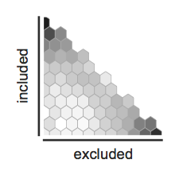
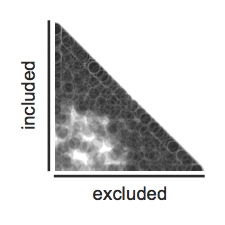
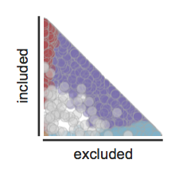

[](https://travis-ci.org/YeoLab/bonvoyage)[](https://pypi.python.org/pypi/bonvoyage)

## What is `bonvoyage`?

Transform percentage-based units into a 2d space to evaluate changes in distribution with both magnitude and direction.

* Free software: BSD license
* Documentation: https://yeolab.github.io/bonvoyage

## Installation

To install this code, clone this github repository and use `pip` to install

    git clone git@github.com:olgabot/bonvoyage
    cd bonvoyage
    pip install .  # The "." means "install *this*, the folder where I am now"


## Usage


To use `bonvoyage` to get waypoints, you want your `data` to be a `pandas`
DataFrame of shape (n_samples, n_features)

```python
import bonvoyage

wp = bonvoyage.Waypoints()
waypoints = wp.fit_transform(data)
```

`bonvoyage` is modeled after `scikit-learn` in is method of creating a
transforming object and then running `fit_transform()` to perform the computation.

To plot the waypoints, use a `waypointplot`, which can do either `"scatter"` or
`"hex"` plot types. By default, `hexbin` plots are used:


```python
import bonvoyage

bonvoyage.waypointplot(waypoints)
```




You can also specify to use `scatter`:

```python
import bonvoyage

bonvoyage.waypointplot(waypoints, kind='scatter')
```



To add color, give a series or other `groupby`-able object:

```python
import bonvoyage

bonvoyage.waypointplot(waypoints, kind='scatter', features_groupby=modalities)
```




## History

### 1.0.0 (2017-06-28)

### 0.1.0 (2015-09-15)

* First release on PyPI.
